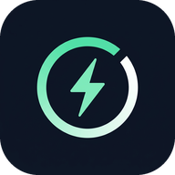

# Ping Booster

<p align="center">
  
</p>

An ultra-light Android "connection keeper": it sends a tiny heartbeat to a host you choose so
mobile data sessions (e.g. Hutch / `oneapp.hutch.lk`) stay awake, and it can be started and
stopped **without opening the app**.

* **Package name:** `com.pingbooster.app`
* **App name:** Ping Booster
* **Min / target SDK:** 24 / 35

---

## What changed in 2.0

| Area | Before | Now |
| --- | --- | --- |
| CPU | New socket + streams + strings every cycle, loop kept running | Zero-poll engine: one pre-built request, 1-byte read, next cycle scheduled only after the previous one ends |
| RAM | Fresh objects per cycle, wake lock + thread held forever | Single low-priority worker thread, no per-cycle allocations, wake lock released when the screen is on |
| UI | Static dark screen | Material 3 dark UI, live status, latency graph, success/uptime stats, instant feedback, no polling |
| Control | App had to be opened | **Quick Settings tile** + **home-screen widget** + notification action: one tap start/stop |
| Icon | Default Android icon | Custom Ping Booster logo (adaptive icon, themed icon layer, matching notification icon) |
| Start/stop | Could fail on Android 12+ background rules | Safe start/stop with `ForegroundServiceStartNotAllowedException` handling, never crashes |

## ඉක්මන් ආරම්භය (Quick start)

1. **Install** — GitHub Actions run එකේ artifact `PingBooster-APK` → `PingBooster-<run>-release.apk`.
2. **Quick settings tile** එක add කරන්න: notification panel එක එකපාරක් පහළට drag කරලා, ආයෙත් පහළට → pencil (edit) icon → "Ping Booster" tile එක tiles area එකට drag කරන්න.
   Android 13+ නම් app එකේ **Add Quick Settings tile** button එක ඔබන්න.
3. **Start/Stop** — tile එක tap කරන්න (හෝ home-screen widget / notification action). App එක open කරන්න ඕන නෑ.
   Tile එකේ දකුණු පසින් live latency එක පෙන්නනවා.
4. **Battery** — අඩුම battery use සඳහා *Reliable mode* off කරන්න; phone එකේ battery optimizer එකෙන් Ping Booster exempt කරන්න (*Battery settings* button).
5. **Target / Interval** — app එකේ card එකෙන් වෙනස් කරන්න; වෙනස්කම් ඊළඟ cycle එකේ ඉඳන් instant apply වෙනවා.

අලුත් logo / icon preview: [`docs/branding/brand-sheet.png`](docs/branding/brand-sheet.png)

## Controls without opening the app

1. **Quick Settings tile** – swipe down twice, tap the pencil, drag *Ping Booster* into your
   tiles. Tap the tile to start, tap again to stop. The tile shows `ON` plus the live latency.
   (On Android 13+ the app has an *Add Quick Settings tile* button that opens the dialog for you.)
2. **Home-screen widget** – shows the live state and a `START` / `STOP` button.
3. **Ongoing notification** – open the app or hit **Stop** straight from the notification.

## Performance notes

* **Stopped** the app uses 0 % CPU and no wakeups - nothing runs in the background at all.
* **Running**, each heartbeat costs a few milliseconds of CPU and reuses three things that the
  old implementation paid for every cycle: the pre-built HTTP request bytes, the cached DNS
  address, and the cached TLS session (so most cycles are a resumed, 1-round-trip handshake
  instead of a full certificate exchange). At the default 15 s interval that is roughly
  0.1-0.2 % of one core on a mid-range phone, with no CPU used between cycles at all.
* The engine re-reads the interval between cycles, so changing it applies instantly.
* The wake lock is only held while the screen is **off** and only in reliable mode; the screen
  being on releases it immediately, and it is renewed cycle by cycle so it can never leak.
* Lowest battery use: interval ≥ 15 s and **Reliable mode** off - the app then never holds a
  wake lock (heartbeats continue while the screen is off, but Doze may batch them).
* Failures back off smoothly (up to 60 s) instead of hammering a dead network, and a stale
  cached address is dropped so the next attempt resolves fresh.

## Build the APK on GitHub

`.github/workflows/build.yml` builds both variants on every push and uploads them:

1. Push to any branch (or run the **Build APK** workflow manually from the Actions tab).
2. Open the run → **Artifacts** → `PingBooster-APK`.
3. Inside: `PingBooster-<run>-release.apk` (minified + resource-shrunk, recommended) and
   `PingBooster-<run>-debug.apk` (easier to inspect). A `SHA256SUMS.txt` is included.

Both APKs are signed with `keystore/pingbooster-ci.p12`, so **new builds install as an update over
older ones** – no uninstall needed. That keystore is a public build key: never use it for store
releases.

> Installing Ping Booster 2.0 for the first time replaces the old *Keep Alive* app
> (`com.ping.keepalive`). Because the package name changed, Android treats it as a new app –
> uninstall the old one after copying your settings across.

## Project layout

```
app/src/main/java/com/pingbooster/app/
├── MainActivity.kt           Material 3 control screen (passive rendering, no polling)
├── PingService.kt            Foreground heartbeat service (the optimisation core)
├── PingEngine.kt             Raw-socket prober (parse + probe, allocation free hot path)
├── PingTileService.kt        Quick Settings tile
├── StatusWidgetProvider.kt   Home-screen widget
├── StatusBus.kt              In-memory state + start/stop plumbing
└── SparklineView.kt          Zero-allocation latency graph
tools/icons/build_icons.py    Regenerates every icon from one source image
docs/branding/               Icon previews (launcher shapes, notification icon, legibility)
```

## Regenerating the branding

```bash
python3 -m venv .venv && .venv/bin/pip install pillow numpy
.venv/bin/python tools/icons/build_icons.py
```

The script only reads `tools/icons/logo-source.png` and rewrites the mipmaps, the adaptive icon
layers, the notification icon and the in-app logo.
